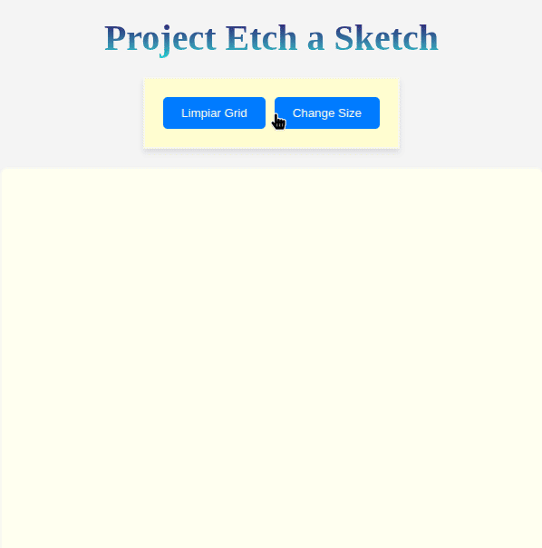

# Etch-a-Sketch

An interactive digital drawing project inspired by the classic Etch-a-Sketch toy, built with HTML, CSS, and vanilla JavaScript.

## 🎨 Features

- **Dynamic Grid**: Create grids of any size (1x1 up to 100x100)
- **Random Colors**: Each cell starts with a randomly generated RGB color
- **Interactive Effects**:
  - Hover: Cells change to dark blue (#020035) on mouse hover
  - Mouse out: Cells change to cyan (#00FFFF) when mouse leaves
- **Intuitive Controls**:
  - Resize button to change grid size
  - Clear button to erase all content

## 🚀 Demo



## 🛠️ Technologies Used

- **HTML5**: Project structure
- **CSS3**: Styling and responsive layout
- **JavaScript ES6**: Interactive logic and DOM manipulation

## 📁 Project Structure

```
etch-a-sketch/
│
├── index.html
├── style.css
├── script.js
└── README.md
```

## Main Functionalities

### Grid Creation

```javascript
function createGrids(size)
```

- Generates a `size x size` grid of elements
- Each cell has a random background color
- Uses CSS Flexbox for responsive layout

### Random Color Generation

```javascript
function getRandomRGB()
```

- Generates random RGB values (0-255 for each channel)
- Returns a string in `rgb(r, g, b)` format

### Interactive Controls

- **Resize**: Allows changing the grid size (1-100)
- **Clear**: Completely erases the container content

## 🎮 How to Use

1. **Draw**: Simply hover your mouse over cells to "draw"
2. **Resize**: Click the "Resize" button and enter a new size (1-100)
3. **Clear**: Use the "Clear" button to erase everything and start fresh

## Customization

### Change Drawing Colors

Modify the values in the event listeners:

```javascript
grid.addEventListener("mouseover", () => {
  grid.style.backgroundColor = "#020035"; // Color on hover
});

grid.addEventListener("mouseout", () => {
  grid.style.backgroundColor = "#00FFFF"; // Color on mouse leave
});
```

### Adjust Size Range

Modify the validation in the resize button:

```javascript
if (newSize === null || isNaN(newSize) || newSize < 1 || newSize > 100) {
  // Change values 1 and 100 according to your needs
}
```

## Known Issues

- The current code has a small bug in grid size validation (line assigning `gridSize = newSize` inside the error condition)
- It's recommended to define the `gridSize` variable globally for better functionality

## Credits

Inspired by the classic Etch-a-Sketch toy and developed as part of learning vanilla JavaScript and DOM manipulation.

---

⭐ Give this project a star if you found it helpful!
